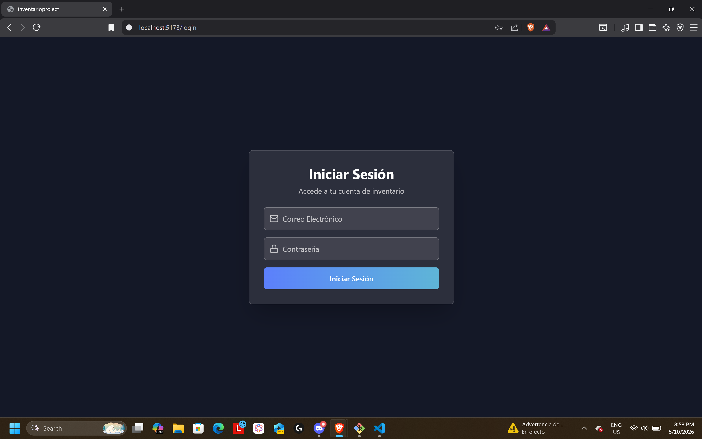
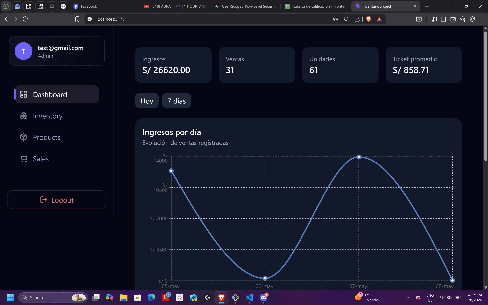
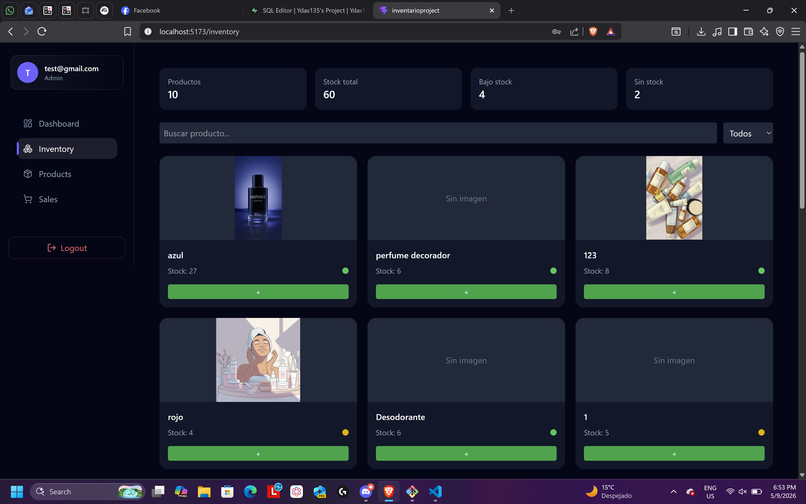
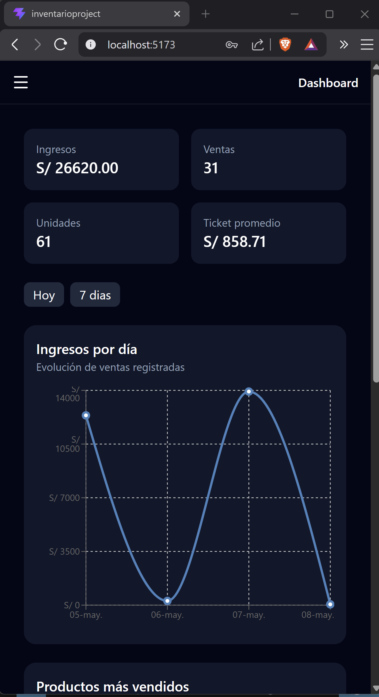

# STOCKFLOW Inventory Management System

> Modern inventory and sales management platform built with React 19, Vite, and Supabase. Multi-user dashboard with authentication, analytics, and real-time inventory control.


## Tech Stack

| Category             | Technology                          |
| -------------------- | ----------------------------------- |
| **Framework**        | React 19 + Vite                     |
| **Language**         | JavaScript ES6+                     |
| **Routing**          | React Router                        |
| **State Management** | Zustand                             |
| **Styling**          | TailwindCSS                         |
| **Backend**          | Supabase                            |
| **Database**         | PostgreSQL                          |
| **Authentication**   | Supabase Auth                       |
| **Charts**           | Recharts                            |
| **Icons**            | Lucide React                        |
| **UI Components**    | Material-UI                         |

## Prerequisites

- **Node.js** 18+
- **npm** or **yarn**
- **Git** for version control
- **Supabase** account for backend

## Preview 






## Getting Started

1. **Clone the repository**

   ```bash
   git clone https://github.com/Ydas135/InventarioProject.git
   cd InventarioProject
   ```

2. **Install dependencies**

   ```bash
   npm install
   # or
   yarn install
   ```

3. **Configure environment variables**

   Create a `.env` file in the root directory:
   You can use `.env.example` as a reference.

   ```env
   VITE_SUPABASE_URL=your_supabase_url
   VITE_SUPABASE_ANON_KEY=your_supabase_anon_key
   ```

4. **Start development server**

   ```bash
   npm run dev
   # or
   yarn dev
   ```

   Server runs at `http://localhost:5173`

## Live Demo 

  https://stockflow-inventory-project.vercel.app

## Scripts

| Command              | Description                    |
| -------------------- | ------------------------------ |
| `npm run dev`        | Start development server       |
| `npm run build`      | Build for production           |
| `npm run preview`    | Preview production build       |
| `npm run lint`       | Run ESLint                     |

## Architecture

The application follows a **Feature-Based Architecture** with clear separation of concerns.

### Project Structure

```
src/
├── app/              # Application configuration
│   ├── auth/         # Authentication components
│   ├── home/         # Home/Dashboard components
│   ├── inventory/    # Inventory management
│   ├── product/      # Product management
│   ├── sales/         # Sales management
│   └── NotFound/     # 404 page
├── backend/          # Backend integration
│   └── supabaseClient.js
├── common/           # Shared code
│   ├── components/   # Reusable UI components
│   │   ├── sidebar/  # Sidebar component
│   │   └── ui/       # UI components like Modal
│   └── layouts/      # Layout components
├── context/          # React contexts
│   └── UserContext.jsx
├── features/         # Feature modules
│   ├── auth/         # Authentication feature
│   ├── home/         # Home/Dashboard feature
│   ├── inventory/    # Inventory feature
│   ├── products/     # Products feature
│   └── sales/        # Sales feature
└── router/           # Routing configuration
    └── router.jsx
```

## Key Features

- **Secure Authentication** with Supabase Auth
- **Multi-user Inventory Management**
- **Product CRUD Operations**
- **Sales Tracking System**
- **Dashboard Analytics** with charts
- **Protected Routes**
- **Persistent Sessions**
- **Role-based Access** using RLS Policies
- **Responsive UI**
- **Real-time Database Integration**
- **Modular Architecture**

### Creating a New Feature

1. Create folder in `src/features/my-feature/`
2. Structure:
   ```
   my-feature/
   ├── components/
   ├── hooks/
   ├── pages/
   ├── services/
   ├── store/
   └── utils/
   ```

## Code Quality

- **ESLint** for linting
- **JavaScript** with modern ES6+ features

Run code checks:

```bash
npm run lint
```

## Contributing

1. Create feature branch: `git checkout -b feature/name`
2. Make changes and commit: `git commit -m "feat: description"`
3. Verify code: `npm run lint`
4. Open Pull Request

### Commit Convention

```
feat: add feature
fix: fix bug
docs: documentation
style: formatting
refactor: code refactoring
test: add tests
chore: dependencies
```

## Database Design 

Main tables used in Database:
- products
- inventory
- sales 
- inventory_movements

Features implemented: 

- Row Level Security (RLS)
- Policies
- Triggers
- Foreign Keys
- Multi-user data isolation

## Backend Integration

The application uses Supabase JavaScript SDK for:

- Authentication
- CRUD operations
- PostgreSQL database access
- Row Level Security (RLS)
- Real-time synchronization

Example query:

```javascript
const { data, error } = await supabase
  .from('products')
  .select('*')
```

## Application Flow

- User authentication handled with Supabase Auth
- Protected routes managed with React Router
- Global state management implemented using Zustand
- CRUD operations connected to Supabase PostgreSQL
- Database protection using Row Level Security (RLS)
- Multi-user data isolation through Supabase Policies

## Future Improvements

- PDF invoice export
- Barcode scanner integration
- Advanced analytics
- Role management system
- Email notifications
- Unit and integration testing

## Responsive Design

The application is optimized for:

- Desktop
- Laptop
- Tablet 
- Mobile Devices

## Resources

- [React Docs](https://react.dev)
- [Vite Guide](https://vitejs.dev)
- [Supabase Docs](https://supabase.com/docs)
- [TailwindCSS](https://tailwindcss.com)
- [Recharts](https://recharts.org)

## License

This project was developed for educational and portfolio purposes